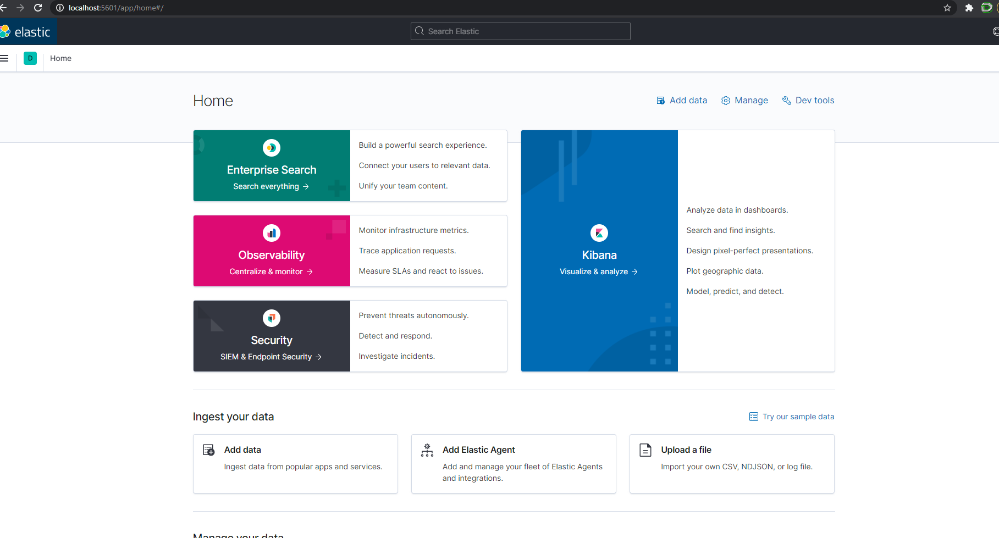

# (ELASTICSEARCH/LOGSTASH/KIBANA DASHBOARD SETUP For Windows 10)  

ElasticSearch, LogStash, Kibana stack instructions to set up in a Windows 10 environment  

1.) Download 7 Zip 64 bit for Windows, [Link Here](https://www.7-zip.org/)  

2.) Install 7-Zip on your Windows 10 machine (windows unzip software runs into errors when unziping some files below)

3.) Make sure to download the same version of each, the versions all need to match up with one another for ElasticSearch, Logstash, and Kibana.  

4.) Download ElasticSearch, [Link Here](https://www.elastic.co/downloads/elasticsearch)  

5.) Download LogStash, [Link Here](https://www.elastic.co/downloads/logstash)  

6.) Download Kibana, [Link Here](https://www.elastic.co/downloads/kibana)  

7.) Take all the downloaded Zip Directories (ElasticSearch, LogStash, Kibana), right click on them in File Explorer, then select 7-Zip -> then select Extract Files...   

8.) After Extracting the three directories above using 7-Zip (may take some time) open Command Prompt  

9.) You need to check if you have Java Installed on your machine, to do this, run the command 'Java -version' in the command prompt. If you do not see the version number there you either need to download java or make sure JAVA_HOME enviorment variable is set toa file path of where your java is located. [Java Help](https://www.elastic.co/guide/en/logstash/current/getting-started-with-logstash.html#ls-jvm)  

10.) After successfully seeing 'Java -verion' run correctly, we can start up our ELK stack app, have three command prompt windows open.  

11.) Navigate to the Unzipped ElasticSearch directory in Command Prompt, when at the base of the Unzipped Directory, run '.\bin\elasticsearch'. You can check http://localhost:9200/ to see if it launched correctly. 

12.) In another Command Prompt, navigate to the Unzipped LogStash Directory, at the base of the Directory run '.\bin\logstash.bat -f .\config\logstash-sample.conf'. You can check http://localhost:9600/ to see if it launched correctly. 

13.) In a third Command Prompt, navigate to the Unzipped Kibana Directory, at the base of the Directory run '.\bin\kibana.bat'.  

14.) Open http://localhost:5601/ in your web browser and you should see the elastic app there to be used.  

15.)   

16.) Now to see some of the Example Capabilities of the ELK stack and play with an Example Kibana dashboard, navigate to 'Add data' in the bottom left of the screen, below Security.  

17.) Then Click on the tab all the way on the right 'Sample Data'  

18.) Then Add the 'Sample web logs' to see how a website's log file (flat file that tracks who visits a website) can be visualized in a dashboard.  

19.) After the data is loaded in, we can click on 'View data' drop down and select Dashboard/Canvas/Map/ or Logs.  

20.) Dashboard is an interactive dashboard that can be used to drill down and filter data (using KQL) and customize visualization, here we can see additional information and data about the visitors of the website, the Canvas is a quick view of the key metrics that the data is telling us, not as filterable as the Dashboard. Map is an interactive map of the location from where the websites visitors came from, you can also see how much data a certain area uses. Lastly you can view the raw log data in the Logs time, but this is more interactive, insightful and visually appealing way to look at logs as commared to raw log text files. All very cool and productive tools to track all different types of data. 
